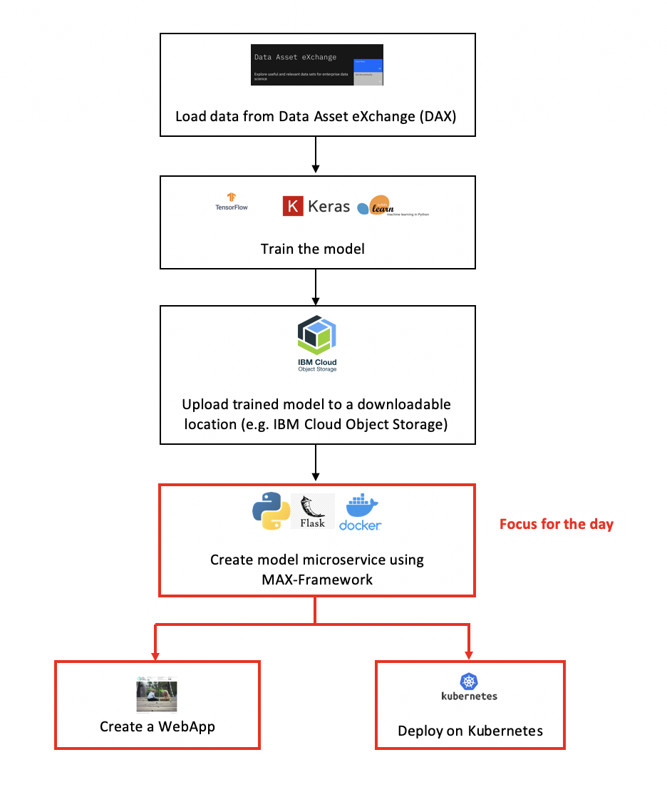

# ODSC-West 2019: Deploying Deep Learning Models as Microservices

When:  October 29 at 2:00 PM
Time: 2pm - 5:30pm

- Session details: https://odsc.com/training/portfolio/deploying-deep-learning-models-as-microservices/
- Authors: IBM Developer, [CODAIT](https://developer.ibm.com/code/open/centers/codait/)
- Presentation: [ADD THE PRESENTATION]
- Prerequisites: [prerequisites.md](prerequisites.md)
- ODSC-West blogpost: https://opendatascience.com/automating-image-annotation-with-max/

## Schedule

| Time          | Activity                                                                                 |
| :------------ | :--------------------------------------------------------------------------------------- |
| 2:00 - 2:30   | Introduction to Model Asset eXchange (MAX)
| 2:30 - 3:00   | How MAX is built: deployment best practices
| 3:00 - 3:15   | Setup (clone repo, download any additional material                                      |
| 3:15 - 3:30   | ☕ *Coffee break*                                                                         |
| 3:30 - 4:30   | Wrap Deep Learning Model for Deployment
| 4:30 - 5:00   | App Creation                                                                             |
| 5:00 - 5:30   | Final Remarks                                                                            |

## Tutorial

Below is the flow chart that demonstrates the structure of the tutorial. 

:exclamation: Join the discussion on slack using this [link](http://ibm.biz/max-slack-invite). :exclamation:

### Tutorial 1: Create a model microservice and deploy in kubernetes

This tutorial has two sections:

1. Wrap a deep learning model as a containerized microservice using the [MAX-Framework](https://ibm.biz/max-framework).

2. Deploy the microservice on Kubernetes.

Follow the instructions provided [here](max-fashion-mnist-wrapping-solution/README.md).

### Tutorial 2: Create a WebApp using the model microservice

Follow the instructions provided [here](https://github.com/CODAIT/max-fashion-mnist-tutorial-app/blob/master/README.md) to create a WebApp.

## Instructors

- [Gabriela de Queiroz](https://k-roz.com/)
- [Simon Plovyt](https://www.linkedin.com/in/splovyt/en)
- [Saishruthi Swaminathan](https://www.linkedin.com/in/saishruthi-swaminathan)

-----

 This work is
licensed under a [Creative Commons Attribution 4.0 International
License](https://creativecommons.org/licenses/by/4.0/).
