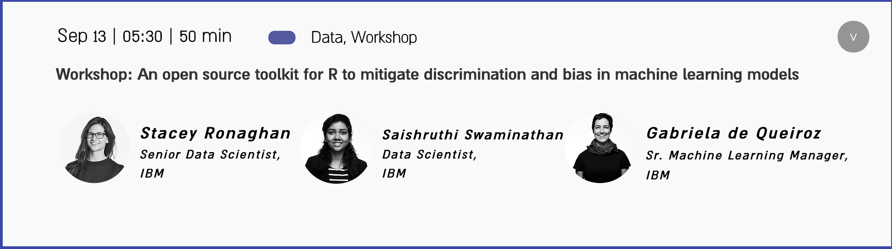

# OpenUp Summit 

#### Workshop: An open source toolkit for R to mitigate discrimination and bias in machine learning models

- Conference website: [https://www.openup.global/?lang=en](https://www.openup.global/?lang=en)

- Slides: Comming soon 

### AIF360 (AI Fairness 360): 

- http://aif360.mybluemix.net/
- R package: https://cran.r-project.org/web/packages/aif360/index.html
- Github: https://github.com/Trusted-AI/AIF360/tree/master/aif360/aif360-r

#### Contacts:

- Gabriela de Queiroz: [website](https://k-roz.com/), [AI Inclusive](https://ai-inclusive.org)
- Stacey Ronaghan: [LinkedIn](https://www.linkedin.com/in/staceyronaghan/)
- Saishruthi Swaminathan: [LinkedIn](https://www.linkedin.com/in/saishruthi-swaminathan/)